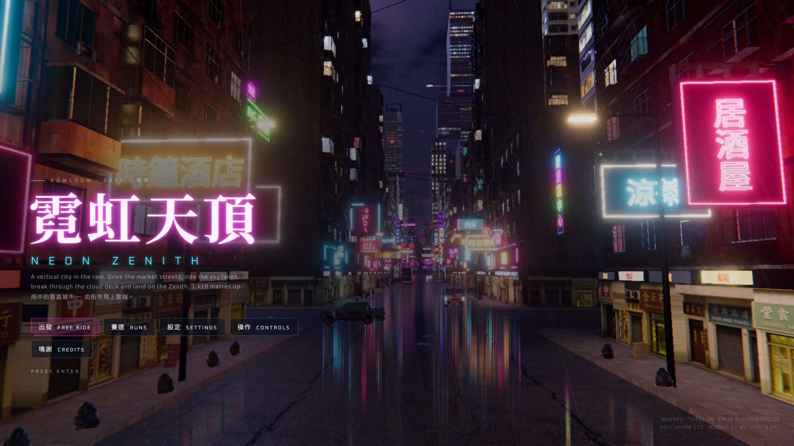
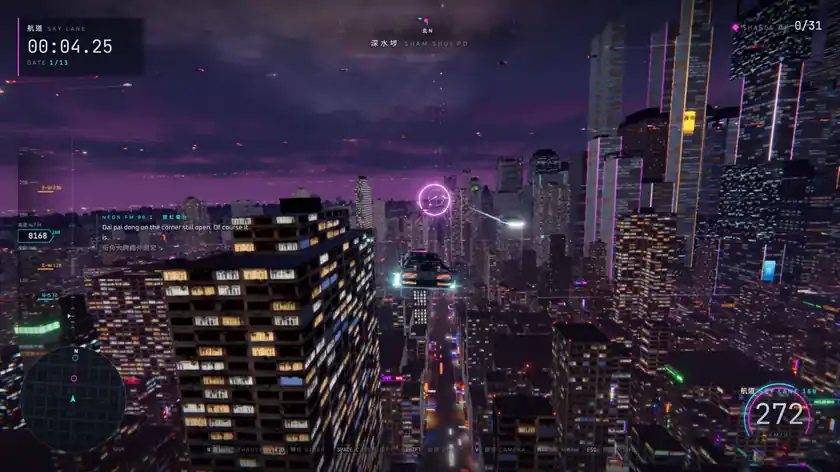
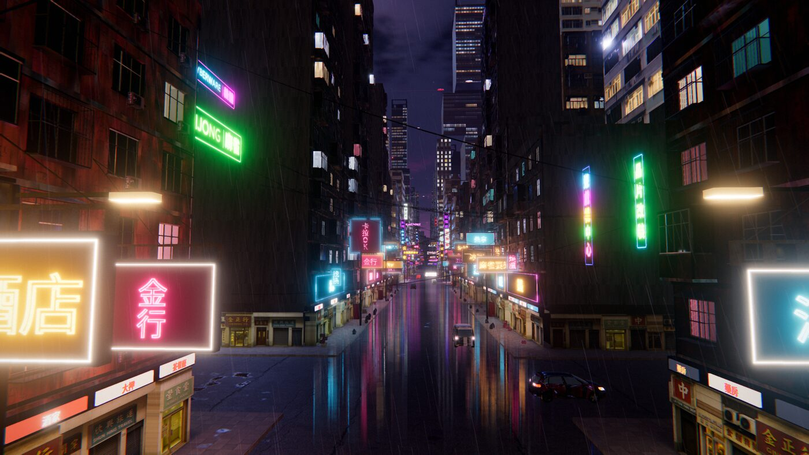
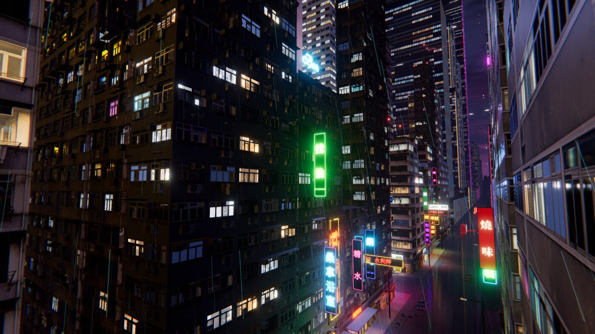
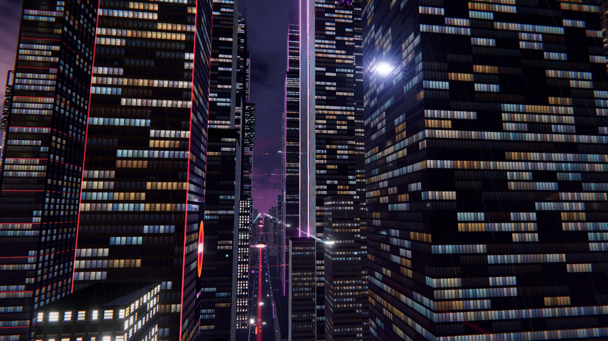
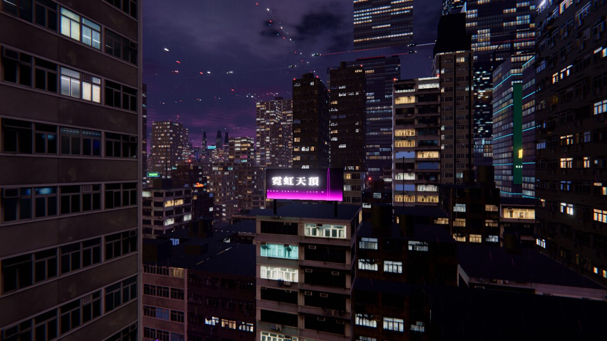
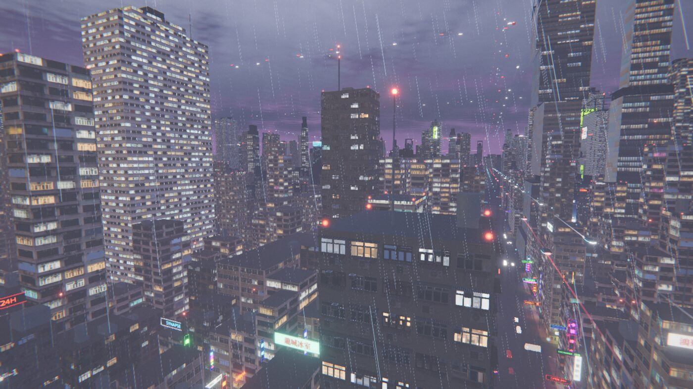
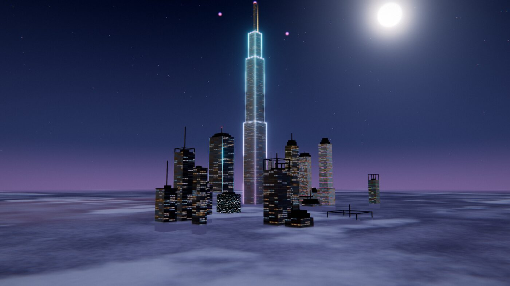
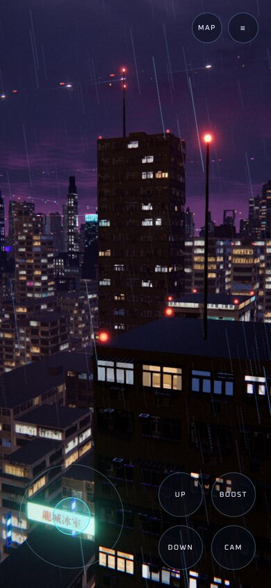

<div align="center">

<a href="https://zenith.billpwchan.art/"></a>

# 霓虹天頂 · Neon Zenith

**A rain-soaked vertical city you can fly through, in your browser.**

Drive the Temple Street night market, lift off into the sky lanes, punch through the storm deck<br>and land on a spire 1,418 metres up. Real-time, open source, built on three.js WebGPU.

**[▶ Play it now](https://zenith.billpwchan.art/)** &nbsp;·&nbsp; [How it works](#how-it-works) &nbsp;·&nbsp; [Run it locally](#run-it-locally) &nbsp;·&nbsp; [Credits](CREDITS.md)

[](https://threejs.org)
[](#browser-support)
[](https://github.com/mrdoob/three.js/wiki/Three.js-Shading-Language)
[](LICENSE)
[](https://github.com/billpwchan/neon-zenith/actions/workflows/build.yml)

</div>

<br>

<p align="center">
  
  <br><sub>The <b>SKY LANE</b> time trial, recorded in real time at 60 fps (autopilot at the stick).</sub>
</p>

## The city

Neon Zenith is a single, continuous city of **9,373 buildings** on a 3.2 km grid, ringed by a harbour and a far shore. Every building, sign, awning, lamp post and rooftop water tank is solid. You can land on any roof, slide under the signs that hang over the street, or thread the canyon between two towers at full boost. Nothing is a skybox.

- **Temple Street, built by hand.** The street you start on is built in Blender lot by lot: modelled tenements in Poly Haven materials, shopfront modules, aircon units, cables, vending machines and bin bags. Its light is baked in Cycles from its own neon, shop windows and street lamps.
- **Buildings with a grammar.** Office towers come in setback, cantilevered-stack, twin-with-sky-bridge, finned-slab and core-and-wings forms. Each gets one of four crowns: an open frame with LED ring beams, a lit drum, a stepped top, or plant rooms under a cornice. Housing estates are cruciform, H-plan or slab. A dozen blocks fuse into arcologies. A street of towers is a street of different buildings.
- **Advertising that belongs to the city.** About 390 giant LED screens sit on podiums, run up tower shafts and stand on rooftop steel frames. They show sixteen fictional campaigns (cyberware clinics, energy drinks, a bank, a noodle bar) drawn to a canvas at load, so there are no image files and no real brands. They wipe between campaigns, glitch, and show their LED pitch when you fly close.
- **Weather with weight.** Rain falls as streaks tinted by the neon beneath them and stops under awnings. Lightning lights the underside of the cloud deck, which has a sea of moonlit cloud above it.
- **A flight model with two regimes.** On the street the KITE hovers a hand's width off the tarmac and drifts like a car. In the air it holds altitude like a VTOL. Taxis, minibuses and KMB buses keep left and stop at signals below you, and sky traffic streams along lanes at 72, 118, 168, 236 and 330 m.
- **Things to do.** Four time trials with medals (MARKET DASH, SKY LANE, ASCENT, THE DIVE), 31 hidden data shards, a city map with waypoints, and a radio.
- **Plays anywhere.** Keyboard, gamepad and touch. Phones get their own HUD and lighter textures. The audio is synthesised at runtime: rain, turbines, thunder and a score that thickens with speed and height. There are no audio files.

## Gallery

<table>
  <tr>
    <td width="50%"><br><sub><b>Temple Street.</b> The baked hero district, lit by its own signs.</sub></td>
    <td width="50%"><br><sub><b>Tenement canyons.</b> Modelled facade kits up close, captured facades beyond.</sub></td>
  </tr>
  <tr>
    <td><br><sub><b>The 168 m lane.</b> Curtain walls lit tenant by tenant.</sub></td>
    <td><br><sub><b>Rooftops.</b> Billboards on steel frames, plant rooms, water tanks.</sub></td>
  </tr>
  <tr>
    <td><br><sub><b>Skyline.</b> Setbacks, crowns and masts with flashing obstruction lights.</sub></td>
    <td><br><sub><b>Above the weather.</b> The Zenith breaks the cloud deck at 660 m.</sub></td>
  </tr>
</table>

## Controls

| | Keyboard | Gamepad | Touch |
|---|---|---|---|
| Thrust / brake | `W` / `S` | `RT` / `LT` | stick |
| Steer | `A` / `D` | left stick | stick |
| Climb / descend | `Space` / `C` | right stick | `UP` / `DOWN` |
| Boost (drift when turning at speed) | `Shift` | `RB` | `BOOST` |
| Camera | `V` | | `CAM` |
| Map · reset to street · horn · radio | `M` · `R` · `F` · `B` | | `MAP` |
| Menu | `Esc` | | `☰` |

<p align="center"></p>

## How it works

Everything renders through three.js's `WebGPURenderer`, and every material is written in **TSL** (three.js's node shading language). TSL compiles to WGSL on WebGPU and to GLSL on the WebGL2 fallback, so there is one source for both. The repository has no `.glsl` file.

### A seeded city that never changes

`src/city/layout.js` lays out streets, districts (market, mixed, centre, estates, docks, the outer ring), blocks, lots, alleys, shops and signs from one seed. It does this in a single pass, and the hand-built district is keyed to the building ids that pass produces. `src/city/massing.js` then shapes every building from **its own** random stream, `rngFor(seed, salt)`. That way new architecture never shifts a lot, a sign or the baked street.

Determinism matters more than it looks. The usual shortcut, `array.sort(() => rng() - 0.5)`, is not deterministic in V8: the engine calls the comparator a different number of times depending on JIT state. We measured 4 calls in 98% of runs and 5 in the rest. Each extra call consumes a random number, so the city changed from load to load. Shuffles here use a seeded Fisher-Yates (`src/core/rng.js`).

### Three levels of facade

| Distance | What you see | How |
|---|---|---|
| < 180 m | **Modelled facade kits**: recessed windows, frames, AC units, grilles | Cells sliced from CC BY models in Blender (`kit_slice.py`), instanced along facades, with LODs |
| any | **Captured facades** of real-looking HK blocks | Orthographic Blender renders of whole modelled buildings (`facade_ortho.py`), packed into texture arrays of albedo, glass/window-id mask and normal. Each window gets its own **interior-mapped room** with parallax walls, furniture, curtains and a lamp, lit or dark per room. |
| any | **Procedural curtain walls** on towers | Analytic in the shader, sharp at any distance. Every tower draws its own grid, floor height, glazing ratio, glass tint and spandrel colour. Offices light by tenant: runs of bays per floor in warm, neutral or daylight tones, with corridor lights left on after hours. |

### Temple Street: composed, baked, packed

`assets-src/district/compose.py` builds the street in Blender. `export.py` unwraps and bakes each object's diffuse light in Cycles, then shelf-packs the results into one 4096² lightmap at roughly 10–14 px/m. It also bakes the light at street level top-down for the ground and for anything that moves. `pack.mjs` writes meshopt-compressed glTF and KTX2 textures: ETC1S for colour, UASTC for normals and data, and **UASTC HDR** for the lightmap. Props get distance LODs, and phones load 1K texture variants.

### Light without a thousand lights

Thousands of neon signs, shop windows and street lamps can't each be a real light, so their spill is rendered once into a top-down 2048² **street-light map** covering 3.5 km (`lightmap.js`). Roads, facades, rain, the fog and the underside of the cloud deck all sample it. Colour from every emitter costs one texture read. Walls also take a city-glow ambient term, warm and neon-tinted near the street and fading to the clouds' violet above. Dark glass picks up a matching reflection.

### Atmosphere

- **Fog** (`atmos/fog.js`) is analytic. Exponential height haze plus a cloud slab are integrated along each view ray, coloured by the street-light map below and moonlit from above.
- **Rain** (`atmos/rain.js`) is stateless. Each drop is a pure function of its index and time, drawn as a streak along its velocity relative to the camera, with splashes near the ground.
- **Post** (`core/post.js`) is scene, then bloom, grade, ACES, chromatic fringe and vignette, FXAA, and grain.

### Performance

A frame-time governor (`core/governor.js`) scales the scene pass when frames are missed and probes back up after a run of clean ones. Measured on an Apple M4 Max at 1920×1080 and device-pixel-ratio 2 (3840×2160 internal), headed Chrome:

| View | Frame time p95 | Frames > 20 ms | Draw calls | Triangles |
|---|---|---|---|---|
| Street level, Temple Street | 18.6 ms | 0 % | ~2,000 | 23 M |
| Mid-air over the markets | 18.5 ms | 0 % | ~1,330 | 19 M |
| Central business district | 18.6 ms | 0 % | ~1,300 | 10 M |
| High over the city | 18.6 ms | 0 % | ~830 | 8 M |

That is a locked 60 fps (vsync) with the resolution scale at 1.00 throughout. Most geometry is instanced in 300–400 m chunks and culled per chunk.

## Run it locally

```bash
git clone https://github.com/billpwchan/neon-zenith.git
cd neon-zenith
npm install
npm run dev          # http://127.0.0.1:5200
```

This needs Node 20.19+. `npm run build` writes a static site to `dist/`, which you can host anywhere. The first load is about 130 MB of assets on desktop (less on phones), which are cached after that. The `deploy/` folder holds the hardened Caddy-in-Docker setup and the release script used for the live demo.

### Browser support

WebGPU runs in Chrome and Edge 113+, Safari 26+ and Firefox 141+ on Windows. Other browsers fall back to WebGL2 automatically. Add `?webgl` to force the fallback.

### Debug URLs

| Parameter | Effect |
|---|---|
| `?play` | Skip the title, start free ride |
| `?run=0`…`3` | Start a time trial (market dash, sky lane, ascent, dive) |
| `&bot` | Let the autopilot fly the run |
| `?fly` / `?cam=x,y,z,yaw,pitch` | Free camera, optionally placed |
| `?webgl` | Force the WebGL2 backend |

`node scripts/shot.mjs '<json>'` takes headed screenshots and frame-time measurements at a given size and pixel ratio. It is the tool behind the numbers above. It drives Chrome through Playwright: set `CHROME_PATH` to a Chrome or Chromium binary, or run `npx playwright-core install chromium` once.

## Rebuilding the assets

The packed, game-ready assets are committed under `public/`. The source models are not, because they are large and each comes from its own site; see [CREDITS.md](CREDITS.md). To rebuild, download the sources into `assets-src/` and run the pipelines from the repository root with Blender 5.x:

```bash
# captured facades → texture arrays (plus ambientCG Facade009 and Facade019B in assets-src/acg/)
for c in assets-src/facade/cfg/{hk3a,hk3c,hk3d,hk3e,hk3f,proc}.json; do blender -b --python assets-src/facade_ortho.py -- $c; done
node assets-src/facades.mjs

# modelled facade kits
blender -b --python assets-src/kit_slice.py -- assets-src/kit/cfg/brown.json
node assets-src/kit.mjs brown hk-brown '^building3win_40$' '^(Merged_materials|building3win_[01]?$|building3win_39$)'

# Temple Street: compose, bake (≈6 min), pack
blender -b --python assets-src/district/compose.py --python assets-src/district/export.py -- assets-src/district/cfg.json
node assets-src/district/pack.mjs

# neon sign atlas, typeset in the browser
node scripts/bake/bake.mjs
```

## Project layout

```
src/
  city/      layout + massing (the generator), buildings (facade shader), facadekit, district,
             adscreens, signs, props, lightmap, zenith
  vehicle/   KITE flight model, chase camera, car model and reflections
  life/      street traffic, sky traffic
  atmos/     sky, clouds, fog, rain, lightning
  game/      runs, shards, medals, title sequence
  core/      post stack, frame governor, input, seeded rng
  ui/        HUD, menus, city map, touch controls
  audio/     synthesised sound and score
assets-src/  Blender and Node pipelines that turn source models into public/
scripts/     screenshot and timing harness, sign atlas baker
```

## How it was made

Built over a weekend in October 2026 with [Claude Code](https://claude.com/claude-code) running **Claude Opus 5.5**. I set the direction and reviewed every pass from screenshots and real-GPU frame timings; the model wrote the code, the TSL shaders and the Blender pipelines.

## More scenes

The same author's other real-time scenes, each open source and running in the browser.

<table><tr>
<td width="33%" valign="top"><a href="https://github.com/billpwchan/sakura-fantasy"></a><br><b><a href="https://github.com/billpwchan/sakura-fantasy">桜幻想 Sakura Fantasy</a></b><br><sub>A boat journey through a Japanese river valley in four seasons · <a href="https://sakura.billpwchan.art/">live</a></sub></td>
<td width="33%" valign="top"><a href="https://github.com/billpwchan/halcyon"></a><br><b><a href="https://github.com/billpwchan/halcyon">Halcyon</a></b><br><sub>A tropical atoll through one day: FFT ocean, reef, bioluminescent night · <a href="https://halcyon.billpwchan.art/">live</a></sub></td>
<td width="33%" valign="top"><a href="https://github.com/billpwchan/utsuroi"></a><br><b><a href="https://github.com/billpwchan/utsuroi">移ろい Utsuroi</a></b><br><sub>A Kyoto house and garden, walked from first light to last · <a href="https://utsuroi.billpwchan.art/">live</a></sub></td>
</tr></table>

## Credits

The code in this repository is MIT licensed. The 3D models are CC BY 4.0 by their authors. Textures and the HDRI are CC0 from Poly Haven and ambientCG. Fonts are under the SIL Open Font License. The advertising, signs and audio were made for this project. The full list, with links and the use of each asset, is in **[CREDITS.md](CREDITS.md)** and in the game under *Credits*.

<div align="center"><br><sub>霓虹天頂 · Kowloon, 2077, raining.</sub></div>
